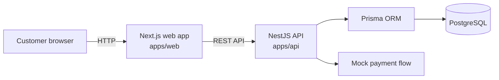

# BrewLite architecture diagram

```mermaid
flowchart LR
    Customer[Customer browser]
    Web[Next.js web app<br/>apps/web]
    API[NestJS API<br/>apps/api]
    Prisma[Prisma ORM]
    DB[(PostgreSQL)]
    Payment[Mock payment flow]

    Customer -->|HTTP| Web
    Web -->|REST API| API
    API --> Prisma
    Prisma --> DB
    API --> Payment
```

For runtime and deployment notes, see [deployment.md](../deployment.md).
